<div align="center">

# 👻 GhostRoute

### Offline Cloud Zombie & Dangling DNS Hunter

**Sub-second, zero-cost static Terraform/OpenTofu state graph auditor that uncovers unattached cloud resources, orphaned load balancers, and dangling DNS subdomain takeover vulnerabilities with $0 cloud API query fees.**

<br/>

[](https://golang.org)
[](https://terraform.io)
[](https://opentofu.org)
[](https://aws.amazon.com)
[](https://cloud.google.com)
[](https://azure.microsoft.com)
[](https://github.com/features/actions)
[](https://sarifweb.azurewebsites.net/)
[](LICENSE)
[](#zero-cost-architecture)

<br/>

[Explore Features](#-key-features) •
[Quickstart](#-instant-quickstart-zero-setup) •
[Architecture](#-system-architecture--logic) •
[Server Deployment](#-deployment-across-different-servers--environments) •
[Use Cases](#-development--production-scenarios) •
[Docs](#-cli-command--flag-reference)

---

</div>

## 📌 Problem Overview

Engineering teams silently leak thousands of dollars every month on forgotten cloud assets:
- **Detached EBS Storage Volumes**: Remain indefinitely billed by AWS after EC2 instances are terminated ($0.08–$0.125/GB/mo).
- **Idle Elastic IPs**: AWS charges $0.005/hour ($3.65/month each) for unattached IPv4 addresses.
- **Orphaned Load Balancers**: ALBs/NLBs left running without target backends accumulate continuous baseline fees (~$16.43/mo base + LCU).
- **Unrouted NAT Gateways**: Idle NAT Gateways sit consuming $32.85/month each while routing zero traffic.
- **Dangling Route 53 / Cloudflare DNS Records**: CNAME or Alias records pointing to decommissioned S3 buckets, deleted GitHub Pages, or abandoned Heroku/Azure web apps allow malicious actors to claim the target resource and execute a **Critical Subdomain Takeover** (phishing, session hijacking, SSL abuse).

### 🛑 Why Existing Tools Fall Short
| Capability | Cloud Custodian / Wiz / Prisma | Infracost | **GhostRoute** 👻 |
|---|---|---|---|
| **Cloud Credentials Required?** | ❌ YES (Needs full IAM read permissions) | ❌ SaaS Account / API Key | **✅ NO (100% Offline)** |
| **Cloud API Query Fees** | ❌ Incurs AWS/GCP API rate costs | ❌ Requires Cloud Sync | **✅ $0.00 (Zero API Queries)** |
| **Speed** | ⏱️ Minutes (Network polling) | ⏱️ 5–15 seconds | **⚡ Sub-second (1 to 5 ms)** |
| **Subdomain Takeover Auditing** | ❌ Rare / Requires heavy plugins | ❌ FinOps only | **✅ 15+ Cloud Signatures Built-in** |
| **Safe Auto-Pruning Scripts** | ❌ Risk of destructive API deletes | ❌ None | **✅ Generates `terraform state rm`** |

---

## ⚡ Key Features

1. **Zero-Cost Static DAG Analysis ($0 API)**:
   GhostRoute reads local `terraform.tfstate` (JSON schema v4) and HCL configs offline. It constructs a **Directed Acyclic Graph (DAG)** of all resource attachments and isolates zero-reference anomalies.
2. **Subdomain Takeover Signature Engine**:
   Concurrently evaluates DNS records against **15+ verified cloud provider takeover signatures** (Amazon S3, GitHub Pages, Heroku, Azure App Service, Traffic Manager, AWS CloudFront, Shopify, Fastly, Netlify, Zendesk, etc.).
3. **FinOps Cost Matrix**:
   Embedded official rate cards for **AWS**, **GCP**, and **Azure** calculate exact monthly and annualized financial leakage down to the cent.
4. **CI/CD Security Gates & SARIF v2.1.0**:
   Native OASIS SARIF output integrates directly with **GitHub Code Scanning**, flagging high-risk PRs before they get merged.
5. **Safe State Pruning**:
   Generates actionable cleanup snippets (`terraform state rm <address>`) so operations teams can decommission zombies without risking production downtime.
6. **Built-in Turnkey `--demo` Mode**:
   Test GhostRoute in **1 millisecond** with zero configuration using the embedded vulnerable cloud fixture!

---

## 🏗️ System Architecture & Logic

```mermaid
flowchart TD
    subgraph Inputs ["1. Local Infrastructure Inputs (Zero Cloud APIs)"]
        TFState["terraform.tfstate / OpenTofu state (JSON v4)"]
        TFHCL["*.tf HCL Declarations"]
        Demo["--demo Built-in Fixture"]
    end

    subgraph ParserLayer ["2. Static Ingestion & Normalization"]
        Parser["Parser Engine (pkg/parser)\n- Extracts Managed Resources\n- Decodes Attributes & Dependencies\n- Maps Cloud Providers (AWS / GCP / Azure)"]
    end

    subgraph GraphLayer ["3. Dependency DAG & Anomaly Engine"]
        DAG["DAG Builder (pkg/graph)\n- Nodes: Cloud Resources\n- Edges: Attachments & Dependencies"]
        OrphanFinder["Zombie Detector (pkg/graph)\n- Unattached Elastic IPs (GHOST-001)\n- Detached EBS Volumes (GHOST-002)\n- Orphaned ALBs with 0 Listeners (GHOST-003)\n- Empty Target Groups (GHOST-004)\n- Unrouted NAT Gateways (GHOST-005)\n- GCP / Azure Disks & IPs (GHOST-007..010)"]
    end

    subgraph VerificationLayer ["4. Offline Verification & FinOps Engines"]
        FinOps["FinOps Cost Calculator (pkg/finops)\n- Embedded Cloud Rate Cards\n- Monthly & Annual Waste Math"]
        DNS["Local Socket DNS & Takeover Scanner (pkg/dns)\n- Concurrent UDP / DoH Resolution\n- 15+ Cloud Provider Fingerprints\n- NXDOMAIN & HTTP 404 Verification"]
    end

    subgraph Outputs ["5. Output Exporters & Remediation"]
        TUI["Terminal ANSI Dashboard (TUI)"]
        SARIF["OASIS SARIF v2.1.0 (GitHub Code Scanning)"]
        JSONReport["Machine-Readable JSON"]
        PruneScript["Safe Prune Script (terraform state rm)"]
    end

    Inputs --> ParserLayer
    ParserLayer --> GraphLayer
    GraphLayer --> VerificationLayer
    VerificationLayer --> Outputs
```



### Logic Traversal Overview
1. **DAG Assembly**: Resources are indexed by address, unique ID, ARN, and IP. Explicit (`dependencies`) and implicit (`volume_id`, `instance_id`, `allocation_id`, `target_group_arn`) relations are resolved into directional edges.
2. **Orphan Isolation**: Traverses nodes where `InDegree == 0` or missing required attachment relations for billable resource types.
3. **DNS Fingerprint Probing**: CNAME/Alias targets matching cloud providers (e.g. `*.s3.amazonaws.com`, `*.github.io`) are probed via local sockets. If response returns `NXDOMAIN` or matches signature bodies (`NoSuchBucket`, `There isn't a GitHub Pages site here`), flags as `CRITICAL`.
4. **Leakage Computation**: Multiplies provisioned units (e.g. GB size, hours/month = 730) against the embedded static pricing catalog.

---

## 🚀 Instant Quickstart (Zero Setup)

You don't need cloud accounts or Terraform files to test GhostRoute right now.

### Option A: Run the Live Demo (Windows / Linux / macOS)
```bash
# Clone the repository
git clone https://github.com/Minhaj009/GhostRoute.git
cd GhostRoute

# Run instant demo scan (takes 1 millisecond!)
go run ./cmd/ghostroute scan --demo
```

### Option B: Use Precompiled Binary (Windows)
```powershell
.\ghostroute.exe scan --demo
```

### Option C: One-Click Automated Test Runner
```powershell
powershell.exe -ExecutionPolicy Bypass -File .\run_tests.ps1
```

---

## 🖥️ Terminal TUI Dashboard Preview

When you run `ghostroute scan --demo`, you get a rich ANSI dashboard:

```
   ██████╗ ██╗  ██╗ ██████╗ ███████╗████████╗██████╗  ██████╗ ██╗   ██╗████████╗███████╗
  ██╔════╝ ██║  ██║██╔═══██╗██╔════╝╚══██╔══╝██╔══██╗██╔═══██╗██║   ██║╚══██╔══╝██╔════╝
  ██║  ███╗███████║██║   ██║███████╗   ██║   ██████╔╝██║   ██║██║   ██║   ██║   █████╗  
  ██║   ██║██╔══██║██║   ██║╚════██║   ██║   ██╔══██╗██║   ██║██║   ██║   ██║   ██╔══╝  
  ╚██████╔╝██║  ██║╚██████╔╝███████║   ██║   ██║  ██║╚██████╔╝╚██████╔╝   ██║   ███████╗
   ╚═════╝ ╚═╝  ╚═╝ ╚═════╝ ╚══════╝   ╚═╝   ╚═╝  ╚═╝ ╚═════╝  ╚═════╝    ╚═╝   ╚══════╝

  GHOSTROUTE - Offline Cloud Zombie & Dangling DNS Hunter
  Target: terraform.tfstate | Scan Time: 1ms
────────────────────────────────────────────────────────────────────────────────────────
  Total Resources: 9     | Zombie Assets: 4     | Dangling DNS: 2     | Monthly Waste: $77.93/mo 
  Annualized FinOps Waste: $935.16 USD/year
────────────────────────────────────────────────────────────────────────────────────────

  FINDINGS & ACTIONABLE REMEDIATION:
────────────────────────────────────────────────────────────────────────────────────────
  SEVERITY     ID         RESOURCE ADDRESS                 IMPACT / WASTE    
────────────────────────────────────────────────────────────────────────────────────────
  [HIGH]       GHOST-003  aws_lb.orphaned_alb              $16.43/mo         
    ↳ Detail: Load Balancer 'aws_lb.orphaned_alb' has 0 active listeners configured in state.
    ↳ Quick Prune: terraform state rm aws_lb.orphaned_alb

  [HIGH]       GHOST-001  aws_eip.unattached_static_ip     $3.65/mo          
    ↳ Detail: Elastic IP 'aws_eip.unattached_static_ip' is not associated with any active EC2 instance.
    ↳ Quick Prune: terraform state rm aws_eip.unattached_static_ip

  [HIGH]       GHOST-005  aws_nat_gateway.idle_nat_gw      $32.85/mo         
    ↳ Detail: NAT Gateway 'aws_nat_gateway.idle_nat_gw' has 0 routing table references directing subnet traffic.
    ↳ Quick Prune: terraform state rm aws_nat_gateway.idle_nat_gw

  [MEDIUM]     GHOST-002  aws_ebs_volume.abandoned_backup  $25.00/mo         
    ↳ Detail: EBS volume 'aws_ebs_volume.abandoned_backup' (250 GB, gp2) is unattached with 0 references.
    ↳ Quick Prune: terraform state rm aws_ebs_volume.abandoned_backup

  [CRITICAL]   GHOST-DNS  aws_route53_record.dangling_s3   Subdomain Takeover
    ↳ Detail: Route53 CNAME points to deleted S3 bucket. S3 returned NoSuchBucket.
    ↳ DNS Route: assets.corp.com -> abandoned-corp-assets.s3.amazonaws.com (Amazon S3)
    ↳ Quick Prune: terraform state rm aws_route53_record.dangling_s3
────────────────────────────────────────────────────────────────────────────────────────
```

---

## 🌐 Deployment Across Different Servers & Environments

GhostRoute is designed to run everywhere without dependencies or network privileges.

### 1. GitHub Actions (Pull Request Quality & Security Gate)
Use GhostRoute directly in your workflow with the native `action.yml`:

```yaml
name: GhostRoute FinOps & Security Audit
on:
  pull_request:
    branches: [ main, master ]
  push:
    branches: [ main, master ]

jobs:
  audit:
    runs-on: ubuntu-latest
    permissions:
      security-events: write # Required for uploading SARIF to GitHub Security tab
      contents: read
    steps:
      - name: Checkout Code
        uses: actions/checkout@v4

      - name: Run GhostRoute Audit
        uses: Minhaj009/GhostRoute@v1
        with:
          state_file: 'terraform.tfstate'
          format: 'sarif'
          output: 'ghostroute-results.sarif'
          fail_on_critical: 'true'

      - name: Upload SARIF to GitHub Code Scanning
        uses: github/codeql-action/upload-sarif@v3
        if: always()
        with:
          sarif_file: ghostroute-results.sarif
```

---

### 2. GitLab CI/CD Pipeline
Add to `.gitlab-ci.yml`:

```yaml
ghostroute_audit:
  image: golang:1.23-alpine
  stage: test
  script:
    - go run ./cmd/ghostroute scan --state terraform.tfstate --format json --output ghostroute-report.json --fail-on-critical
  artifacts:
    reports:
      dotenv: ghostroute-report.json
    paths:
      - ghostroute-report.json
  rules:
    - if: $CI_PIPELINE_SOURCE == "merge_request_event"
```

---

### 3. Linux / Ubuntu / Debian Production Servers
Download or compile the static binary:

```bash
# Compile standalone binary
go build -ldflags="-s -w" -o /usr/local/bin/ghostroute ./cmd/ghostroute

# Scan infrastructure directory
ghostroute scan /opt/terraform/production --state /opt/terraform/production/terraform.tfstate
```

---

### 4. Kubernetes CronJob (Scheduled Weekly FinOps Patrol)
Run GhostRoute as a lightweight scheduled job inside Kubernetes:

```yaml
apiVersion: batch/v1
kind: CronJob
metadata:
  name: ghostroute-finops-patrol
spec:
  schedule: "0 9 * * 1" # Every Monday at 9:00 AM
  jobTemplate:
    spec:
      template:
        spec:
          containers:
          - name: ghostroute
            image: golang:1.23-alpine
            command: ["/bin/sh", "-c"]
            args:
              - |
                go run ./cmd/ghostroute scan --state /tf-state/terraform.tfstate --prune-file /tf-state/cleanup.sh
                cat /tf-state/cleanup.sh
            volumeMounts:
            - name: tf-state-vol
              mountPath: /tf-state
          restartPolicy: OnFailure
          volumes:
          - name: tf-state-vol
            persistentVolumeClaim:
              claimName: terraform-state-pvc
```

---

### 5. Air-Gapped / Highly Secure VPC Servers
In isolated environments without internet connectivity, use the `--skip-dns` flag for 100% offline graph traversal:

```bash
# Operates purely on local memory graph with zero socket queries
ghostroute scan --state terraform.tfstate --skip-dns
```

---

## 💼 Development & Production Scenarios

### Scenario 1: Developer Pre-Commit Hook
Prevent accidentally committing orphaned infrastructure before pushing:

Add to `.pre-commit-config.yaml` or `.git/hooks/pre-commit`:
```bash
#!/usr/bin/env bash
echo "Running GhostRoute Pre-Commit Check..."
ghostroute scan --state terraform.tfstate --fail-on-critical
if [ $? -ne 0 ]; then
    echo "GhostRoute detected critical zombie resources or dangling DNS. Aborting commit."
    exit 1
fi
```

### Scenario 2: Automated Safe Pruning Workflow
When infrastructure drifts and you need to safely prune orphaned state without deleting active systems:

```bash
# 1. Generate the safe prune script
ghostroute scan --state terraform.tfstate --prune-file safe-prune.sh

# 2. Inspect the generated commands
cat safe-prune.sh

# 3. Apply the state prune safely
bash safe-prune.sh
```

### Scenario 3: Continuous Subdomain Takeover Bug Bounty Prevention
Audit company DNS zones against active DNS targets without requiring access to AWS console:

```bash
# Audit individual target domain
ghostroute dns-audit --zone docs.mycorp.com --target myproject.github.io
```

### Scenario 4: OpenTofu & Terraform Cloud Migration Verification
When migrating from Terraform Cloud to OpenTofu or local backend, run GhostRoute before and after to verify zero resource degradation:

```bash
ghostroute scan --state pre-migration.tfstate --format json --output pre.json
ghostroute scan --state post-migration.tfstate --format json --output post.json
diff pre.json post.json
```

---

## 📖 CLI Command & Flag Reference

### `ghostroute scan [path]`
Scans a Terraform/OpenTofu state file or directory for unattached assets, dangling DNS, and cost leakage.

| Flag | Short | Default | Description |
|---|---|---|---|
| `--state` | `-s` | `""` | Direct path to `terraform.tfstate` |
| `--format` | `-f` | `tui` | Output format: `tui`, `sarif`, `json` |
| `--output` | `-o` | `""` | File to write report output |
| `--prune-file`| `-p` | `""` | File path to write safe `terraform state rm` script |
| `--demo` | | `false` | Run instant scan on built-in vulnerable fixture |
| `--fail-on-critical` | | `false` | Exit code 1 if CRITICAL or HIGH issues are detected |
| `--skip-dns` | | `false` | Disable local socket DNS queries (pure offline DAG scan) |

### `ghostroute dns-audit`
Performs a targeted DNS audit against a specific zone or CNAME destination.

```bash
ghostroute dns-audit --zone status.example.com --target status-page.herokuapp.com
```

### `ghostroute catalog`
Displays the embedded static FinOps cloud pricing matrix for AWS, GCP, and Azure.

```bash
ghostroute catalog
```

### `ghostroute version`
Prints binary version, Git commit hash, and build timestamp.

---

## 💰 FinOps Static Pricing Catalog

GhostRoute uses calibrated standard hourly/monthly rate cards (730 billable hours/month):

| Cloud | Resource Type | Hourly Rate | Monthly Rate | Billing Metric |
|---|---|---|---|---|
| **AWS** | `aws_eip` (Idle) | $0.00500 | **$3.65/mo** | per unattached IP |
| **AWS** | `aws_ebs_volume` (gp3) | $0.00011 | **$0.08/mo** | per detached GB |
| **AWS** | `aws_ebs_volume` (gp2) | $0.00014 | **$0.10/mo** | per detached GB |
| **AWS** | `aws_ebs_volume` (io2) | $0.00017 | **$0.125/mo** | per detached GB |
| **AWS** | `aws_lb` / `aws_alb` | $0.02250 | **$16.43/mo** | per orphaned LB (base) |
| **AWS** | `aws_nat_gateway` | $0.04500 | **$32.85/mo** | per unrouted Gateway |
| **GCP** | `google_compute_address` | $0.01000 | **$7.30/mo** | per unused static IP |
| **GCP** | `google_compute_disk` (Standard) | $0.00006 | **$0.04/mo** | per detached GB |
| **GCP** | `google_compute_disk` (SSD) | $0.00023 | **$0.17/mo** | per detached GB |
| **Azure** | `azurerm_public_ip` | $0.00500 | **$3.65/mo** | per unassociated IP |
| **Azure** | `azurerm_managed_disk` | $0.00010 | **$0.075/mo** | per detached GB |

---

## 🛡️ Subdomain Takeover Fingerprint Coverage

GhostRoute includes automated signature matching for 15+ providers:

| Provider | Monitored Domains | Vulnerability Signatures | Severity |
|---|---|---|---|
| **Amazon S3** | `s3.amazonaws.com`, `s3-website*` | `NoSuchBucket`, `The specified bucket does not exist` | **CRITICAL** |
| **GitHub Pages** | `github.io` | `There isn't a GitHub Pages site here` | **CRITICAL** |
| **Heroku** | `herokuapp.com`, `herokudns.com` | `No such app`, `There's nothing here, yet.` | **CRITICAL** |
| **Azure App Service** | `azurewebsites.net`, `cloudapp.net` | `404 Web Site not found` | **CRITICAL** |
| **Azure Traffic Manager** | `trafficmanager.net` | `NXDOMAIN` status | **CRITICAL** |
| **AWS CloudFront** | `cloudfront.net` | `The request could not be satisfied`, `Bad request` | **HIGH** |
| **Shopify** | `myshopify.com` | `Sorry, this shop is currently unavailable` | **CRITICAL** |
| **Fastly** | `fastly.net`, `fastlylb.net` | `Fastly error: unknown domain` | **CRITICAL** |
| **Netlify** | `netlify.app`, `netlify.com` | `Not Found - Request ID:` | **CRITICAL** |
| **Zendesk** | `zendesk.com` | `Help Center Closed` | **CRITICAL** |
| **Surge.sh** | `surge.sh` | `project not found` | **CRITICAL** |
| **Ghost** | `ghost.io` | `The thing you were looking for is no longer here` | **HIGH** |
| **Readme.io** | `readme.io` | `Project doesnt exist... yet!` | **CRITICAL** |

---

## 🤝 Contributing

We welcome community contributions, additional cloud provider rules, and signature updates!

1. Fork the Project: `git clone https://github.com/Minhaj009/GhostRoute.git`
2. Create your Feature Branch: `git checkout -b feat/new-cloud-rule`
3. Commit your Changes: `git commit -m "feat: add oracle cloud unattached volume rule"`
4. Run the Automated Test Suite: `go test -v -cover ./...`
5. Push to the Branch: `git push origin feat/new-cloud-rule`
6. Open a Pull Request.

---

## 📄 License

GhostRoute is distributed under the **Apache 2.0 License**. See [`LICENSE`](LICENSE) for complete terms.
